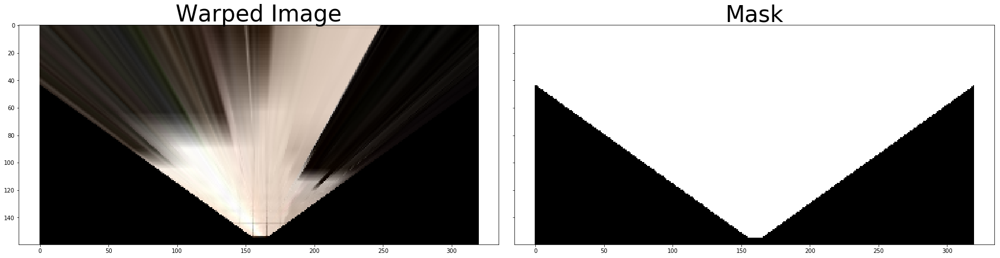
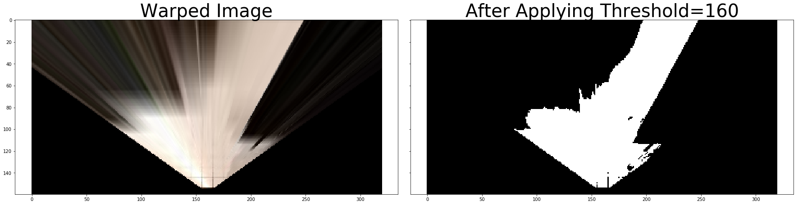
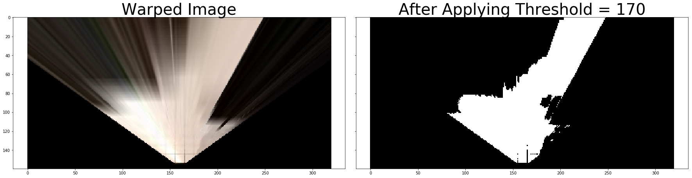
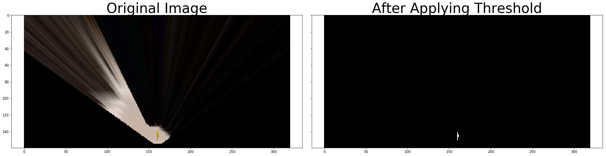
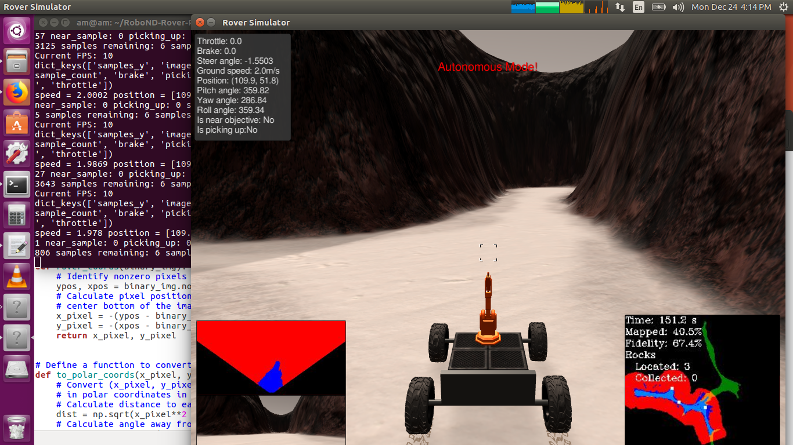

# Search and Sample Return
## Robo Nanodegree Project 1
### Narotam Singh

The aim of the project is to make the rover perceive its surroundings using the camera and make decisions based on that and sucessfully navigate the terrain. Another important component of the project is that Rover should be able to locate the stones it finds in its path.

## [Rubric](https://review.udacity.com/#!/rubrics/916/view) Points
### Here I will consider the rubric points individually and describe how I addressed each point in my implementation.  

---
### Writeup / README

#### 1. Provide a Writeup / README that includes all the rubric points and how you addressed each one.  You can submit your writeup as markdown or pdf.  

You're reading it!

### Notebook Analysis
#### 1. Run the functions provided in the notebook on test images (first with the test data provided, next on data you have recorded). Add/modify functions to allow for color selection of obstacles and rock samples.

The first step was to take the perspective transform of the image taken by the rover. To do this I use the base code provided by Udacity in class lectures and modify it to also generate a mask which I can later use to identify obstacles. Below you can see both the warped image and the corresponding mask.

The second step was to write the color threshold function. Again the base code was take from Udacity lectures, however, I found that base threshold values of 160 for the three channels (RGB) do not provide a very good fidelity. Hence I experimented with different values of threshold. Finally in the `perception.py` I use threshold value of 165 for the three color channels. The image below shows the warped image and its thresholded image for threshold values of 160, 165 and 170 respectively.

I also defined an additional function to determine the presence of rock in the image `find_rocks`, it is very similar  to the `color_threshold` function, however the threshold for the three color channels are different here. The warped image with the rock and its thresholded image is shown below.

The code provided had provided some supporting functions to transform among different views and cordinates, I left them unchanged.

#### 1. Populate the `process_image()` function with the appropriate analysis steps to map pixels identifying navigable terrain, obstacles and rock samples into a worldmap.  Run `process_image()` on your test data using the `moviepy` functions provided to create video output of your result. 

The `process_image()` function involved 7 basic steps.
1. Define source and destination points for perspective transform.
2. Apply perspective transform.
3. Apply color threshold to identify navigable terrain/obstacles/rock samples. The navigable terrain and rocks was straight forward, to find obstacle I had to use the mask generated from `perspect_transorm()` function: `np.absolute(np.float32(threshed) - 1) * mask `
4. Convert thresholded image pixel values to rover-centric coords. This was done with the help of `rover_coords()` supporting function provided by Udacity. I had to do it for all the three images: navigable terrain, obstacle and rocks.
5. Convert rover-centric pixel values to world coords. For this we needed the data stored during training phase (I used the data provided by Udacity). The xpos, ypos and yaw was noted from the rover training data a used to convert rover centric pixels values to world cords with the help of `pix_to_world()` function. 
6. Update worldmap (to be displayed on right side of screen). The information above is then used to update the worldmap. I also ensured that if a terrain is marked both navigable and with obstacle, then navigable gets preference.
7. Make a mosaic image, finally all the above was combined together with the rover view and ground truth view.

Below you can see the video obtained as a result of `process_image` as applied on the training data:

 click on the link to see the video.

### Autonomous Navigation and Mapping

#### 1. Fill in the `perception_step()` (at the bottom of the `perception.py` script) and `decision_step()` (in `decision.py`) functions in the autonomous mapping scripts and an explanation is provided in the writeup of how and why these functions were modified as they were.

The steps used above were then directly incoporated into the `perception_step()` function, intialy I had thought that I will process rock images only if a rock is there as I implemented in the notebook, but while writing perception I found on my system this does not take much time, so I kept my `perception_step()` function simple. 

The `decision_step()` function provided by Udacity was working ok, so I decided not to change it for my first project. 

#### 2. Launching in autonomous mode your rover can navigate and map autonomously.  Explain your results and how you might improve them in your writeup.  

**Note: running the simulator with different choices of resolution and graphics quality may produce different results, particularly on different machines!  Make a note of your simulator settings (resolution and graphics quality set on launch) and frames per second (FPS output to terminal by `drive_rover.py`) in your writeup when you submit the project so your reviewer can reproduce your results.**

I run the simulator with screen resolution of 1024 x 768 and screen quality good on Ubuntu 16.04 machine. The screen shot below of the simulator shows that my Rover navigated the map area (greater than 40%) with a fidelity of 67.4%.

There are various ways the rover performance can be improved:
1. The `decision` step can be made more robust so that it does not collide with small rocks (obstacles) in the path.
2. The `perception` step can be further fine tuned to detect these small obstacles in the pathway.
